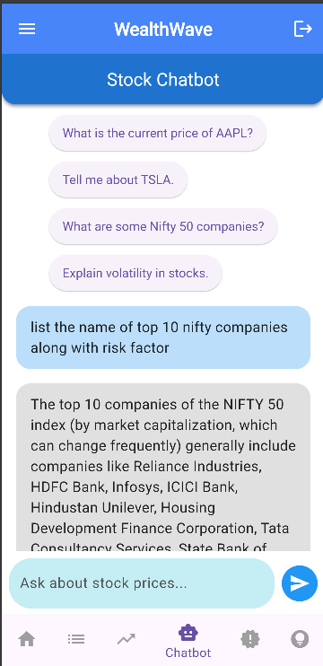
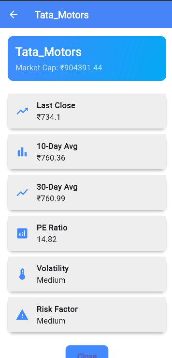
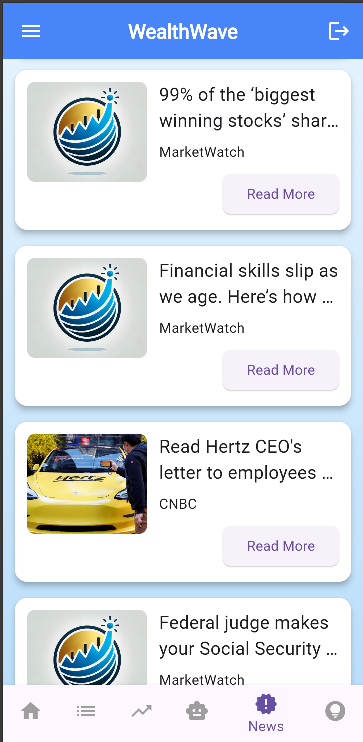
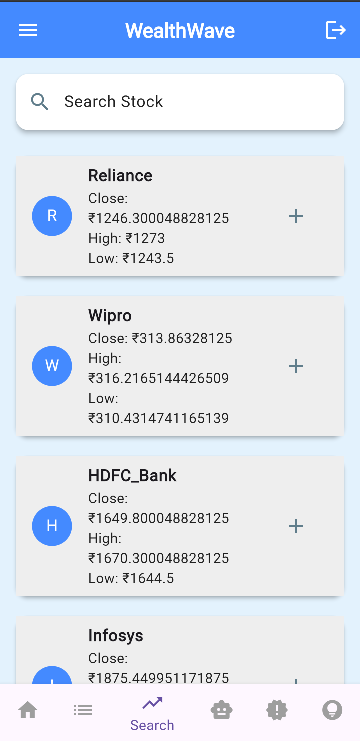

# 📈 Wealth Wave — Your Personal Stock Assistant

Wealth Wave is a powerful stock assistant application built using **Flutter** and **Firebase** that helps users navigate the stock market intelligently and efficiently.

The app provides modern financial tools including:
- AI-powered stock assistance
- Real-time market news
- Interactive stock charts
- Personalized watchlists
- Smart stock recommendations
- Price prediction features

Whether you're a beginner investor or an experienced trader, Wealth Wave offers an all-in-one stock analysis experience.

---

### **🚀 Features:**

- **🔐 Secure Authentication:**  
  Seamless **Email & Google Sign-In** using **Firebase Auth** for quick and secure access.
  
- **📊 Stock Overview:**  
  Get a quick snapshot of the **Nifty 50 stocks** with detailed charts and insights that help you make informed decisions.

- **🤖 AI-Powered Chatbot:**  
  Our intelligent **AI chatbot**, powered by **Gemini** and **Finnhub API**, answers all your stock-related queries on the go!

- **🎯 Personalized Recommendations:**  
  Receive **personalized stock recommendations** based on your preferences and market trends.

- **🔎 Search & Watchlist:**  
  Track your **favorite stocks** and keep an eye on their performance with a custom **watchlist**.

- **📰 Market News:**  
  Stay updated with the latest **stock market news** fetched in real-time via the **Finnhub API**.

- **📈 10-Day Price Predictions:**  
  Get accurate **10-day stock price predictions** powered by **Linear Regression Machine Learning** algorithms.

- **🌙 Dark/Light Mode:**  
  Toggle between **dark** and **light** modes for an optimized user experience.

---

### **📱 Screenshots**

Explore how the app looks on your phone:

<table>
  <tr>
    <td align="center">
      <strong>Chatbot Interaction</strong> 
      
    </td>
    <td align="center">
      <strong>Stock Details Overview</strong> 
      
    </td>
  </tr>
  <tr>
    <td align="center">
      <strong>Market News Access</strong> 
      
    </td>
    <td align="center">
      <strong>Search Functionality</strong> 
      
    </td>
  </tr>
</table>

---

### **🔗 Technologies Used:**

- **Flutter:** Mobile app framework for cross-platform development  
- **Firebase:** Backend services for authentication, database, and hosting  
- **Gemini API:** AI-powered stock query engine  
- **Finnhub API:** Real-time stock market data and news  
- **Machine Learning:** Linear regression for price prediction  
